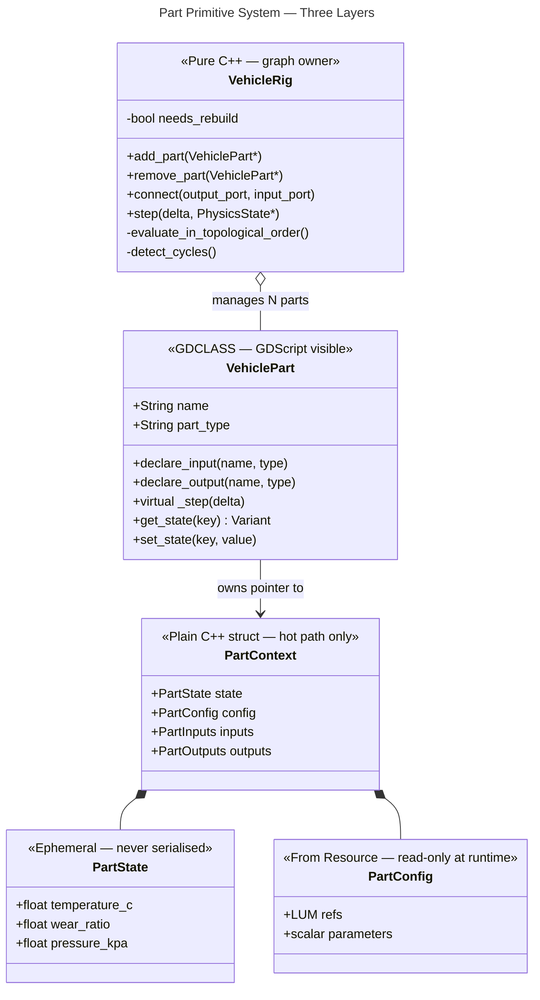
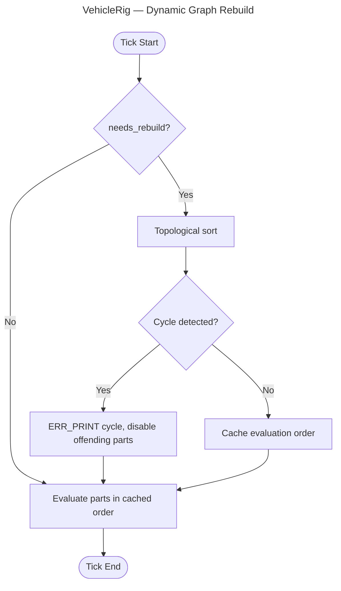
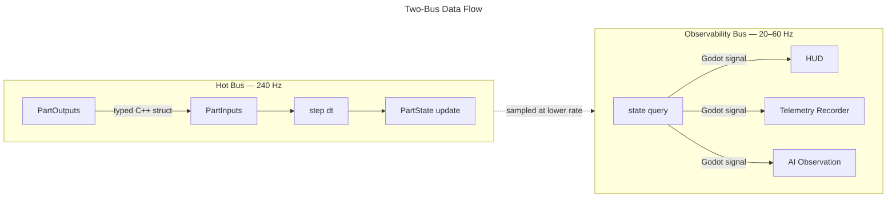

# Part Primitive System — Architecture

> **Purpose**: Defines the composable, data-driven architecture replacing the current monolithic VehicleSolver. Every vehicle component is built on one general primitive. New parts can be defined in C++ or GDScript.
>
> **Audience**: Developers working on VehicleExtension and the Trackside game layer.
>
> **Status**: Design decisions locked. Implementation has not begun.

---

## The Problem With the Current Shape

The existing VehicleExtension has three structural deficiencies identified in the March 2026 design session:

| # | Problem | Symptom |
|---|---------|---------|
| 1 | No per-part simulation loop | Everything is one flat force evaluation per tick inside `VehicleSolver`. Parts cannot evolve independently. |
| 2 | LUMs treated as the result | `TireModel::compute()` returns forces directly from a LUM lookup. LUMs should feed physics, not replace it. |
| 3 | Stateful things have no state | Tyre temperature, wear, suspension history, engine thermal state — none of these exist. Every tick starts from scratch. |

These are additive gaps, not structural failures. The fix is the **Part Primitive System**, which addresses all three without discarding the existing LUT infrastructure or resource contracts.

---

## Core Design: Three Layers



### Layer 1 — VehiclePart (GDCLASS)

**What it is**: The GDScript-visible contract. Every vehicle component — engine, tyre, suspension corner, aero surface, gearbox, brake disc — is a `VehiclePart` subclass.

**What it enforces** (the five contracts):

| Contract | Method / Field | Notes |
|----------|---------------|-------|
| Update | `_step(delta: float)` | Called each tick by VehicleRig. GDScript can override. |
| State | `get_state(key)` / `set_state(key, value)` | Read-only access from GDScript for HUD/telemetry. Never serialised. |
| Config | `load_config(resource: Resource)` | Sets up LUM refs and scalar parameters from a `.tres` file. |
| Wiring | `declare_input()` / `declare_output()` | Declares port names and types at init time. Validated by VehicleRig. |
| Identity | `name`, `part_type`, `description` | Queryable at runtime. Used for telemetry and debug UI. |

**Why GDCLASS**: A C++ base class can be subclassed by GDScript. This lets a developer write a custom aero surface or a simplified AI-model part entirely in GDScript, with no C++ required.

**Critical rule**: The hot path (`_step` implementation for C++ parts) never calls through the GDCLASS wrapper. C++ implementations override a pure virtual `step()` in the C++ base; GDScript implementations pay the GDScript dispatch cost (~1–5 µs per call). GDScript parts are acceptable for single-car scenarios; for multi-car simulation, use C++-implemented parts.

### Layer 2 — PartContext (Plain C++ Structs)

**What it is**: The hot-path data. Not a GDCLASS, not serialised, not visible to GDScript directly.

```cpp
// Hot path structs — no Godot dependencies, no virtual dispatch
struct PartState {
    float temperature_c   = 20.0f;  // evolves via ODE each tick
    float wear_ratio      = 0.0f;   // 0 = new, 1 = end of life
    float pressure_kpa    = 220.0f; // tyre pressure (if applicable)
};

struct PartConfig {
    LumHandle grip_lut;   // ref into LUTExpansion, read-only
    LumHandle thermal_lut;
    float     mass_kg     = 0.0f;
};

struct PartInputs  { /* typed per-part, declared at init */ };
struct PartOutputs { /* typed per-part, declared at init */ };
```

**Why separate from the GDCLASS**: A `Resource` in Godot is shared by path — two cars loading the same `tire_spec.tres` would share the same state. That is a correctness bug, not a style preference. Keeping simulation state in plain C++ structs gives each `VehicleRig` its own independent state pool, regardless of which Resource files were loaded.

**Serialisation rule**: `PartState` is NEVER exposed with `ADD_PROPERTY`. It must not appear in `.tres` saves. Only `PartConfig` fields (loaded from Resources) are serialised.

### Layer 3 — VehicleRig (Graph Owner)

**What it is**: Pure C++. Owns the directed acyclic graph of VehicleParts and drives the simulation.

**Responsibilities**:
- Maintains list of parts and port connections
- Detects graph changes (add/remove part, connect/disconnect port) via `needs_rebuild` flag
- Re-computes topological evaluation order on the next tick when `needs_rebuild` is true
- Detects cycles at rebuild time; logs offending parts, disables them, raises error
- Evaluates each part in dependency order each tick
- Owns fidelity level (`FULL`, `SIMPLIFIED`, `DEAD_RECKONING`) — skips expensive parts in lower tiers

**Dynamic rewiring (damage model)**:



Damage events set `needs_rebuild = true`. The sort is O(V + E) and runs once per structural change, never per tick.

---

## The Two-Bus Model



**Hot bus**: Typed C++ struct reads, no allocations, no Godot API calls. Runs every physics tick at 240 Hz.

**Observability bus**: GDScript-accessible signals. VehicleBody samples key state variables (tyre temperature, RPM, slip angle) at a configurable rate (default 20 Hz) and emits Godot signals. HUD, telemetry recorder, and AI observation layers subscribe.

**Thread safety**: If `ProjectSettings/physics/3d/run_on_separate_thread` is enabled, state variables exposed to GDScript use `std::atomic<float>` for reads. The physics thread writes; the main thread reads. Locking is not required for float reads on x86_64 (naturally atomic), but `std::atomic` makes the intent explicit.

---

## Optional Contracts

Not all five contracts are mandatory for every part. A part *declares* which contracts it supports. VehicleRig checks at init time.

| Contract | Mandatory? | Parts that typically skip it |
|----------|-----------|----------------------------|
| Update (`_step`) | **Yes** — every part | None |
| State | Optional | Pure-function parts (brake bias controller, rigid mass) |
| Config | Optional | Parts fully defined by code (e.g. a physics utility) |
| Wiring | Optional | Leaf parts with no upstream dependencies |
| Identity | **Yes** — every part | None |

In C++, optional contracts are expressed as capability flags queried at init time, not as virtual methods that all parts must implement. This avoids vtable slots for functionality a part doesn't have.

---

## Fidelity Tiers

VehicleRig supports three fidelity levels. This enables the same part graph to serve all deployment targets.

| Tier | Who uses it | What runs |
|------|------------|-----------|
| `FULL` | Player car, dedicated singleplayer AI | All parts, all state, all LUM evaluation |
| `SIMPLIFIED` | AI cars on-track alongside player | Tyre + suspension forces, no thermal/wear state |
| `DEAD_RECKONING` | Multiplayer remote cars | No simulation; position/velocity from network snapshot |

Parts declare their minimum required fidelity tier. VehicleRig skips parts whose tier exceeds the current level.

### Multiplayer Sync

Multiplayer uses **client-side prediction + snapshot interpolation**:
- Server runs `SIMPLIFIED` physics for all cars at 30–60 Hz
- Server broadcasts authoritative `{position, rotation, linear_vel, angular_vel, gear, rpm}` per car
- Client runs `FULL` physics for the player car speculatively
- Remote cars on the client: `DEAD_RECKONING` with smooth position correction to server snapshots
- Only macroscopic state is synced — `TireState.temperature` is never transmitted

---

## Devil's Advocate Challenges — Resolved

During the design session, a devil's advocate agent challenged every major decision. The resolutions are recorded here as permanent context.

### DA1 — Five contracts on a universal primitive creates hot-path overhead

**Challenge**: Enforcing all five contracts on every part (including trivial parts like a rigid rotor) adds wiring, identity, and virtual dispatch overhead. At 240 Hz × 20 cars × N parts, it aggregates.

**Resolution**: Contracts are optional capabilities, not mandatory interface methods. Minimum is `step()` + identity. Overhead exists only for contracts the part explicitly opts into. Simple/pure-function parts carry near-zero overhead.

### DA2 — LUMs as inputs to other LUMs is a dataflow engine, not a LUM system

**Challenge**: A LUM whose inputs come from another LUM requires topological ordering, cycle detection, and a runtime owner. This is a DAG evaluator, not a lookup table.

**Resolution**: Named correctly. The LUM computation graph IS a static DAG evaluated by VehicleRig. The existing LUTExpansion API is unchanged — it evaluates individual tables. VehicleRig is responsible for calling them in the correct order. Cycles are detected at init time (or on damage-triggered rebuild).

### DA3 — Multiplayer + piston-stroke fidelity + non-deterministic Jolt is irreconcilable

**Challenge**: Godot's Jolt integration is not deterministic across platforms. Full-fidelity state rollback for reconciliation would require replaying a huge state vector at 240 Hz.

**Resolution**: Remote cars in multiplayer use `DEAD_RECKONING` tier — no full-fidelity simulation. Client-side prediction + snapshot interpolation (industry-standard approach) means the player car runs full-fidelity, remote cars run lightweight position interpolation. The architecture does not need Jolt determinism.

### DA4 — Plastic deformation cannot be represented by pre-baked LUMs

**Challenge**: LUMs are stateless maps. Plastic deformation is path-dependent — the output depends on loading history, not just current load. Adding deformation history as a LUM axis causes dimensionality explosion.

**Resolution**: Elastic deformation (current-load → displacement) is LUM-suitable. Plastic deformation is modelled as a scalar `accumulated_damage` state variable that feeds into the LUM as one additional axis. The "complete physics of crush depth over a spatial mesh" is out of scope for a game; a scalar damage state is sufficient for game-feel damage modelling.

---

## Open Questions

These were not resolved in the design session and are deferred to the first implementation sprint.

| Question | Options | Impact |
|----------|---------|--------|
| How are optional contracts declared? | Capability flags (bitmask on the C++ base), or query method `has_contract(ContractType)` | Affects initialisation cost |
| How do PartInputs/PartOutputs types work for GDScript-defined parts? | Dictionary with runtime type declaration, or a fixed typed interface? | Affects GDScript extensibility |
| Final name for the graph system | `VehicleRig` vs `PartGraph` vs `SimGraph` | Naming only |
| LUM evaluation ordering in the DAG | Does VehicleRig own this entirely, or does LUTExpansion gain a "pipeline" concept? | Affects LUTExpansion scope |

---

## Related Documents

- [[VehicleExtension — Architecture Decisions]] — Decisions 4–7 reference this document
- [[Vehicle Physics/Vehicle Physics]] — Tier 1 implementation plan
- [[Trackside — Index]] — full project map
